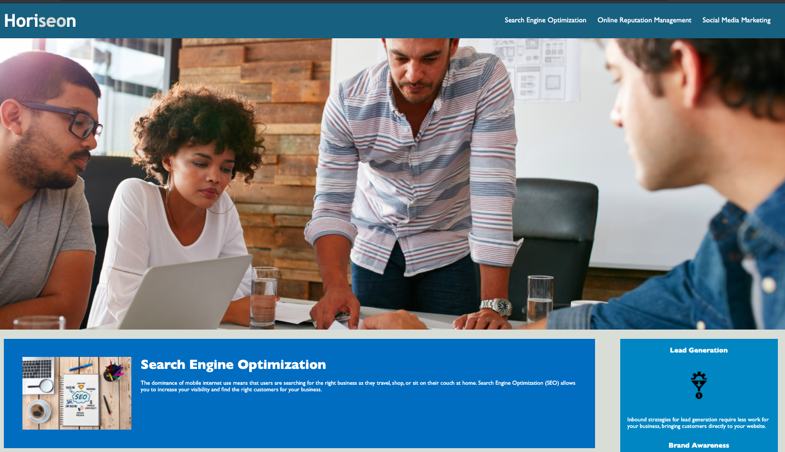
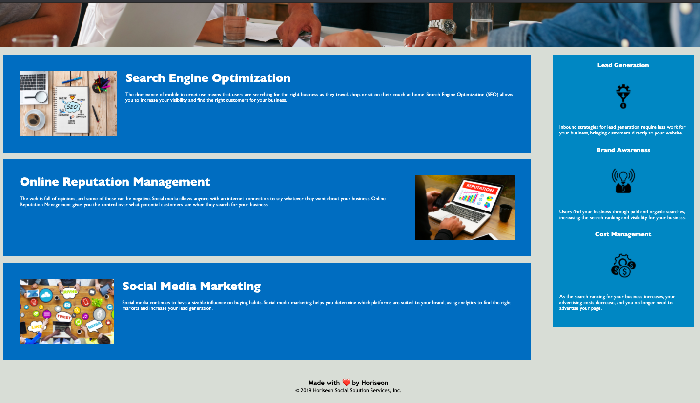

# Code Refactor Starter Code 

## Motivation
My motivation for this project was in refactoring the code to optimize it for search engines. I made sure that all links are functioning correctly. I reworked the CSS to make it more efficient by consolidating CSS selectors and properties, organizing them to follow the semantic structure of the HTML elements, and included comments before each element or section of the page.

## What does the application do?
The application allows for the user to click on the anchored navigation lists to direct them to the appropriate corresponding content found in the application. In addition, the benefits section was created to correspond with the strategies of the company used to increased business. 

### Challenges
A few of the challenges of the project were ensuring that the navigation links worked, images contained the appropriate alt text for accessibility purposes, condensing repetitive css styles, and informative annotation was provided.

### Knowledge gained
* I learned that html code can be div heavy and needs to be separated by sections and/or articles for a cleaner presence and better accessibility.
* I learned that class attributes can be strategically placed to condense the overall html and css presentation and documentation.
* I learned that, as is found in the hero section, the use of a decorative image in the background is better placed in the css style sheet than placed directly in the html file as referenced here [reference](https://stackoverflow.com/questions/7678883/is-it-better-to-define-images-in-direct-html-or-css).

The following image shows the web application's appearance and functionality:

[Code Refactor Finished Project] (https://1jorcarver.github.io/challenge1/